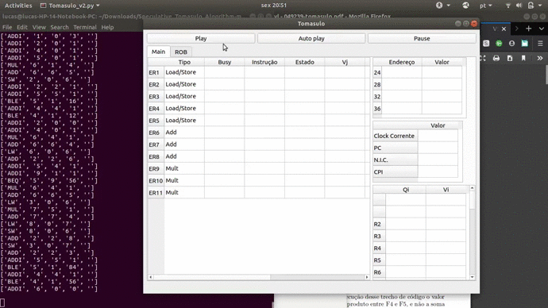

# Speculative_Tomasulo_Algorithm

\# Instructions / 说明 :

 

To run the program in ubuntu, use:

$python3 Tomasulo_v2.py <binary_program_name>

To run the program with the benchmark:

$python3 Tomasulo_v2.py benchmark_binary

 
 

 
 

Our code simulates the Computer Architecture hardware algorithm developed by Tomasulo (Robert Tomasulo, IBM, 1967). This architecture enhances performance by allowing out-of-order execution of instructions, register renaming in hardware, reservation stations and the Common Data Bus, for example.

Many modern high-performance processors use a derivative of Tomasulo’s architecture for dynamic scheduling.
